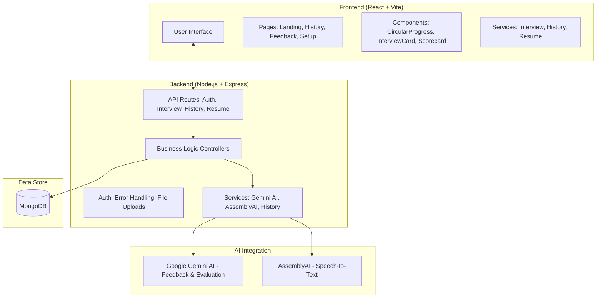

# 🚀 Intervue - AI Mock Interview Platform

**Intervue** is a premium, AI-powered mock interview platform designed to help developers and professionals ace their technical interviews. By leveraging state-of-the-art AI models, it provides a realistic interview experience with actionable feedback, score breakdown, and progress tracking.

---

## 🏛️ Project Architecture

The application follows a modern **MERN (MongoDB, Express, React, Node)** stack architecture with integrated AI services for intelligence.



### 🔹 Core Components

-   **Frontend (Vite + React)**: A high-performance, responsive UI built with Tailwind CSS v4 and Framer Motion for smooth animations.
-   **Backend (Node.js + Express)**: A scalable RESTful API handling authentication, interview orchestration, and data persistence.
-   **AI Engine (Gemini)**: Powers the technical evaluation, question generation, and detailed feedback reports.
-   **Transcription (AssemblyAI)**: Provides real-time and post-interview audio-to-text conversion.
-   **Database (MongoDB)**: Stores user profiles, interview history, and performance metrics.

---

## 🛠️ Technology Stack

| Layer | Technologies |
| :--- | :--- |
| **Frontend** | React 19, Vite, Tailwind CSS v4, Framer Motion, React Icons |
| **Backend** | Node.js, Express.js, JWT, Multer, PDF.js |
| **AI Services** | Google Gemini AI (`@google/genai`), AssemblyAI |
| **Database** | MongoDB (Mongoose) |
| **Dev Tools** | ESLint, Vite, PostCSS |

---

## ✨ Key Features

-   **AI Interviewer**: Interactive mock interviews tailored to your job role and resume.
-   **Real-time Transcription**: Converts your spoken answers into text using AssemblyAI.
-   **Deep Feedback**: Get detailed analysis on Communication, Technical Knowledge, Problem Solving, and more.
-   **Visual Progress Tracking**: Beautiful circular progress indicators and history charts to monitor improvement.
-   **Resume Analysis**: Upload your PDF resume to receive custom-tailored interview questions.
-   **Premium UI/UX**: Modern "Ocean Blue" claymorphism aesthetic with smooth micro-animations.

---

## 🚀 Getting Started

### Prerequisites
- Node.js (v18+)
- MongoDB (Local or Atlas)
- Google Gemini API Key
- AssemblyAI API Key

### Installation

1. **Clone the repository**
   ```bash
   git clone https://github.com/Takshak-S/Intervue.git
   cd Intervue
   ```

2. **Setup Server**
   ```bash
   cd server
   npm install
   # Create a .env file based on .env.example
   npm run dev
   ```

3. **Setup Client**
   ```bash
   cd ../client
   npm install
   npm run dev
   ```

---

## 📁 Project Structure

```text
Intervue/
├── client/                 # React Frontend
│   ├── src/
│   │   ├── components/     # Reusable UI components
│   │   ├── context/        # Auth & App state
│   │   ├── pages/          # Full page views
│   │   └── services/       # API calling logic
├── server/                 # Node.js Backend
│   ├── src/
│   │   ├── config/         # DB & AI configurations
│   │   ├── controllers/    # Route handlers
│   │   ├── models/         # Mongoose schemas
│   │   ├── routes/         # API endpoints
│   │   └── services/       # AI & business logic
└── README.md               # You are here!
```

---

## 🛡️ License
Distributed under the MIT License. See `LICENSE` for more information.

---

*Built with ❤️ by [Takshak](https://github.com/Takshak-S)*
